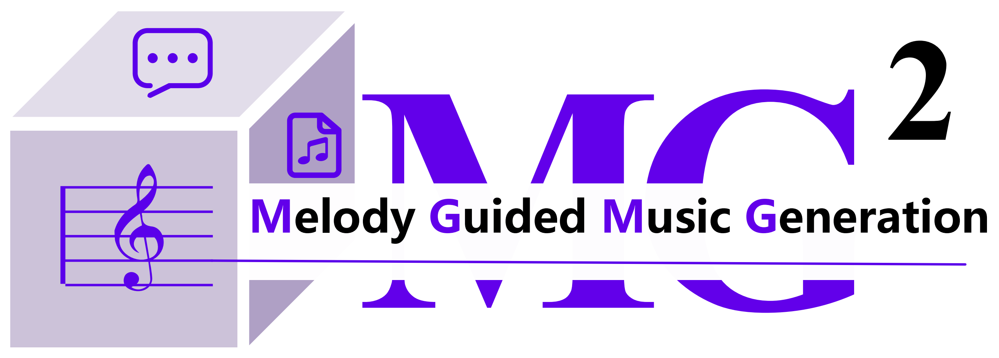

# Awesome-Music-Generation  
  
## Welcome to MG<sup>2</sup>!
### Try our demo first! 
&ensp; &rarr; &ensp; 
<a href="https://awesome-mmgen.github.io/"></a> &ensp; &larr; &ensp; Click here!

&ensp; &rarr; &ensp; 
<a href="https://arxiv.org/abs/2409.20196"></a> &ensp; &larr; &ensp; Click here!


&ensp; &rarr; &ensp; 
<a href="https://huggingface.co/ManzhenWei/MG2"></a> &ensp; &larr; &ensp; Click here!  
This repository contains the implementation of the music generation model **MG<sup>2</sup>**, the first novel approach using melody to guide the music generation that, despite a pretty simple method and extremely limited resources, achieves excellent performance.

Anyone can use this model to generate personalized background music for their short videos on platforms like TikTok, YouTube Shorts, and Meta Reels. Additionally, it is very cost-effective to fine-tune the model with your own private music dataset.

## Video
You can watch the introduction video on  

&ensp; &rarr; &ensp; 
<a href="https://youtu.be/kc2n-ByWB-M?si=U-gjvAuBjD-HOtS7"></a> &ensp; &larr; &ensp; Click here!

&ensp; &rarr; &ensp; 
<a href="https://www.bilibili.com/video/BV1K84FeBEqo/?share_source=copy_web&vd_source=d808713ed70be6b862e6ccbcb28d2f5b"></a> &ensp; &larr; &ensp; Click here!

## Online Service

Now you can try music generation with your own prompt on our   

&ensp; &rarr; &ensp; 
<a href="https://mg2.vip.cpolar.cn/"></a> &ensp; &larr; &ensp; Click here!

**Tips**: To generate high-quality music using MG<sup>2</sup>, you would want to craft detailed and descriptive prompts that provide rich context and specific musical elements.


## Quick Start

To get started with **MG<sup>2</sup>**, follow the steps below:

### Step 1: Clone the repository
```bash
git clone https://github.com/shaopengw/Awesome-Music-Generation.git
cd Awesome-Music-Generation
```

### Step 2: Set up the Conda environment
```bash
# Create and activate the environment from the provided environment file
conda env create -f environment.yml
conda activate MMGen_quickstart
```

### Step 3: Download checkpoints from [huggingface]([https://huggingface.co/ManzhenWei/MMGen](https://huggingface.co/ManzhenWei/MG2))
```bash
# Ensure that the checkpoints are stored in the following directory structure
Awesome-Music-Generation/
└── data/
    └── checkpoints/
```

### Step 4: Modify the PYTHONPATH environment variables in the quick_start.sh script
```bash
# Update the paths to reflect your local environment setup
# Replace:
export PYTHONPATH=/mnt/sda/quick_start_demonstration/Awesome-Music-Generation:$PYTHONPATH
export PYTHONPATH=/mnt/sda/quick_start_demonstration/Awesome-Music-Generation/data:$PYTHONPATH
# With:
export PYTHONPATH=/your/local/path/Awesome-Music-Generation:$PYTHONPATH
export PYTHONPATH=/your/local/path/Awesome-Music-Generation/data:$PYTHONPATH
```

### Step 5: Assign execution permissions for the script
```bash
chmod +x quick_start.sh
```
### Step 6: Execute the quick start script
```bash
bash quick_start.sh
```
### Allow the script to run for several minutes. Upon completion, the results will be available in the following directory:
```bash
Awesome-Music-Generation/log/latent_diffusion/quick_start/quick_start
```
## Dataset
### MusicSet
We introduce the new MusicSet dataset, featuring approximately 150,000 high-quality 10-second music-text pairs. The dataset can be accessed at the following URL: https://huggingface.co/datasets/ManzhenWei/MusicSet
### CLMP training dataset format
In the training of CLMP, it is necessary to align and train the three dimensions of audio, text-description, and melody-text. We utilize the webdataset format for the training data of audio and text-description, and separately load the melody-text using a dataloader. Within the [MusicSet](https://huggingface.co/datasets/ManzhenWei/MusicSet) dataset, we have already processed the data into the webdataset format. If you wish to use your own training data and package it into the webdataset format, please refer to the instructions at the following link: https://github.com/webdataset/webdataset

```bash
# Ensure that the training data packaged in the webdataset format is placed in the following directory
clmp/
└── dataset/
    └── MusicSet/
        └──train/pretrain0.tar
                 pretrain1.tar
                 pretrain2.tar
                 ...
        └──valid/
        └──test/
```
### MG<sup>2</sup> of diffusion training dataset format
When training MG<sup>2</sup>, it is necessary to convert .flac files to .wav format.
```bash
Awesome-Music-Generation/
└── data/
    └── dataset/
       └── audioset/
           └── wav/xxx.wav
                   xxx.wav
                   ...
       └── metadata/dataset_root.json
           └── MusicSet/
               └── datafiles/train.json
                             valid.json
                             test.json
```
Here is an example content for dataset_root.json:
```bash
{
    "MusicSet": "/mnt/data/wmz/Awesome-Music-Generation/data/dataset/audioset",
    "comments": {},
    "metadata": {
      "path": {
        "MusicSet": {
          "train": "./data/dataset/metadata/MusicSet/datafiles/train.json",
          "test": "./data/dataset/metadata/MusicSet/datafiles/test.json",
          "val": "./data/dataset/metadata/MusicSet/datafiles/valid.json",
          "class_label_indices": ""
        }
      }
    }
  }
```
### MelodySet

## Todo List
- [x] Demo website
- [x] Huggingface checkpoints
- [x] Quick start (Inference)
- [x] Training Datasets
- [ ] Training/fine-tuning code
- [x] Online free generation service
- [ ] Checkpoints on larger datasets

---
### Feel free to explore the repository and contribute!
---
## Acknowledgement

We sincerely acknowledge the developers of the following open-source code bases. These resources are invaluable sparks that ignite innovation and progress in the real world 🎆!

- [https://github.com/CompVis/stable-diffusion](https://github.com/CompVis/stable-diffusion)
- [https://github.com/haoheliu/AudioLDM-training-finetuning](https://github.com/haoheliu/AudioLDM-training-finetuning)
- [https://github.com/LAION-AI/CLAP](https://github.com/LAION-AI/CLAP)
- [https://github.com/jik876/hifi-gan](https://github.com/jik876/hifi-gan)
- [https://github.com/facebookresearch/faiss](https://github.com/facebookresearch/faiss)
- [https://mtg.github.io/mtg-jamendo-dataset](https://mtg.github.io/mtg-jamendo-dataset)
>The research is supported by the Key Technologies Research and Development Program under Grant No. 2020YFC0832702, and National Natural Science Foundation of China under Grant Nos. 71910107002, 62376227, 61906159, 62302400, 62176014, and Sichuan Science and Technology Program under Grant No. 2023NSFSC0032, 2023NSFSC0114, and Guanghua Talent Project of Southwestern University of Finance and Economics.

## Citation

```bibtex
@article{wei2024melodyneedmusicgeneration,
      title={Melody Is All You Need For Music Generation}, 
      author={Shaopeng Wei and Manzhen Wei and Haoyu Wang and Yu Zhao and Gang Kou},
      year={2024},
      eprint={2409.20196},
      archivePrefix={arXiv},
      primaryClass={cs.SD},
      url={https://arxiv.org/abs/2409.20196}, 
}
